# Black-Box System Identification Using PO-MOESP + PEM

System identification of a black-box system using the subspace identification method PO-MOESP and the prediction error method PEM.

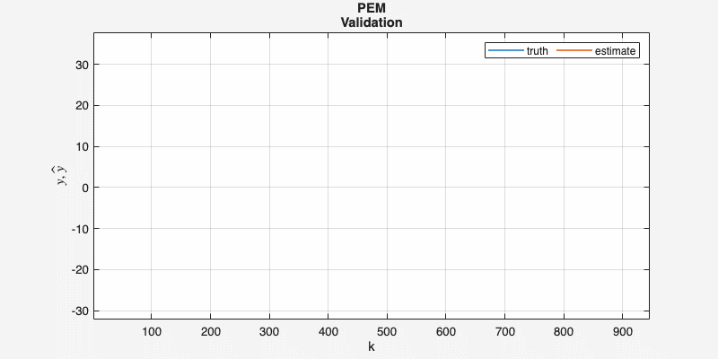

## The Problem

The system under test is a true black box: a compiled function `exciteSystem(id, u, fs)` that returns the sampled output `y` for any input sequence `u` and sampling frequency `fs`, with no access to its internals.

The task is to identify the system by following the complete identification cycle: excitation input generation, data acquisition, data preprocessing, model structure and order selection, fitting, and validation, repeated until an accurate model is obtained, as assessed by the RMSE and VAF metrics.

## Headline Result

| Model | Dataset | VAF (%) | RMSE |
|---|---|---:|---:|
| PO-MOESP| Training | 95.57 | 2.78 |
| PO-MOESP + PEM | Training | 99.48 | 0.95 |
| **PO-MOESP + PEM** | **Validation** | **99.34** | **1.19** |

## Part 1: Experiment Design & Data Preprocessing

A random amplitude staircase is used as the **persistently exciting input** signal.

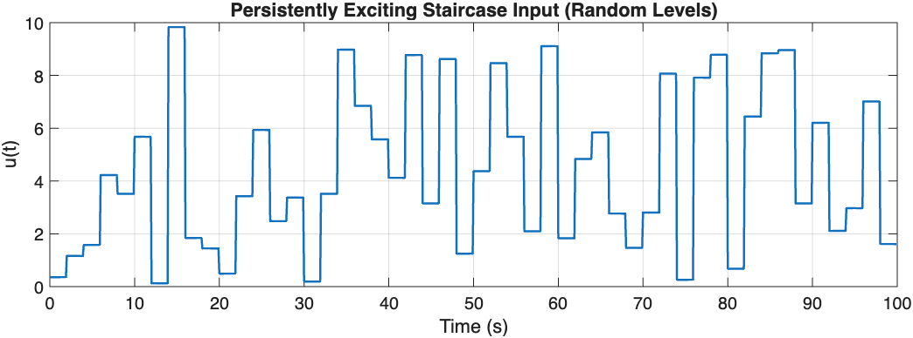

The order of persistent excitation was verified using the rank of a block Hankel matrix of the input (`persistency_of_excitation.m`), which exceeds order 100.

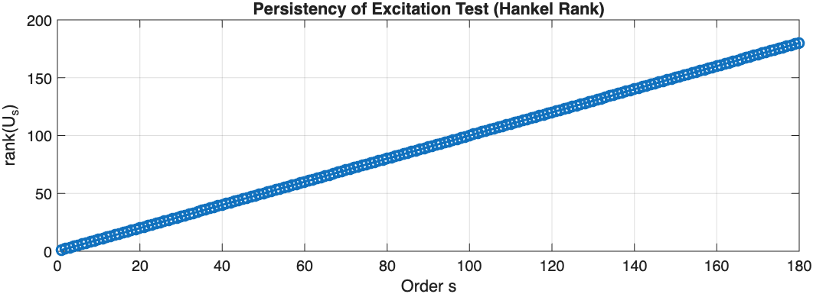

**Spike removal.** MAD based spike removal with interpolation: $6 \times 1.4826 \times \mathrm{MAD}$ from the median

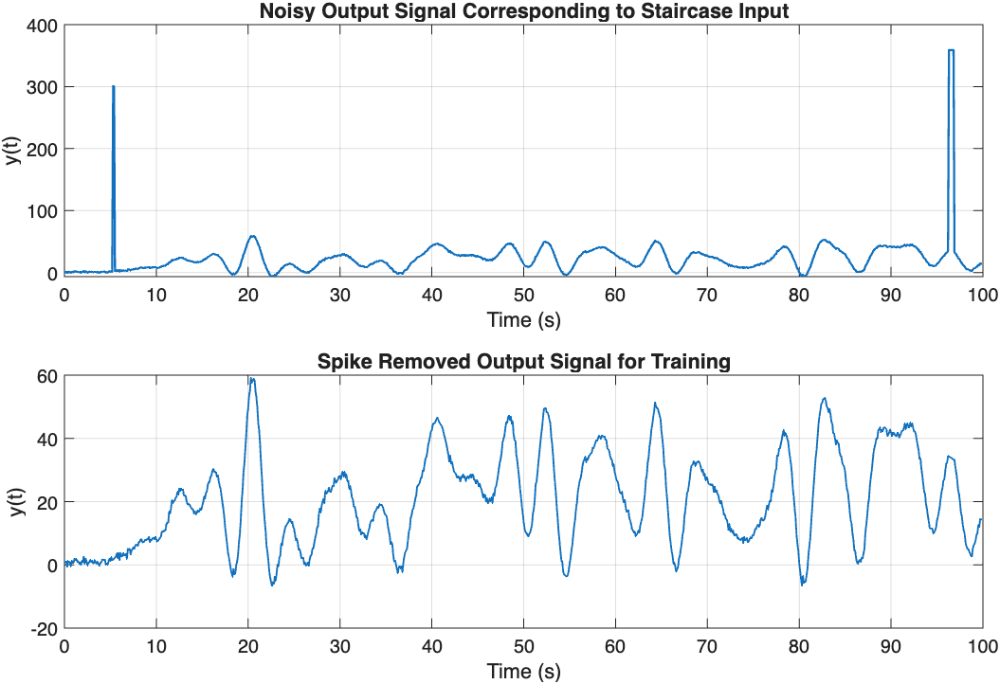

**Time delay.** The causal lag removal: Approximately 5.4 s (54 samples).

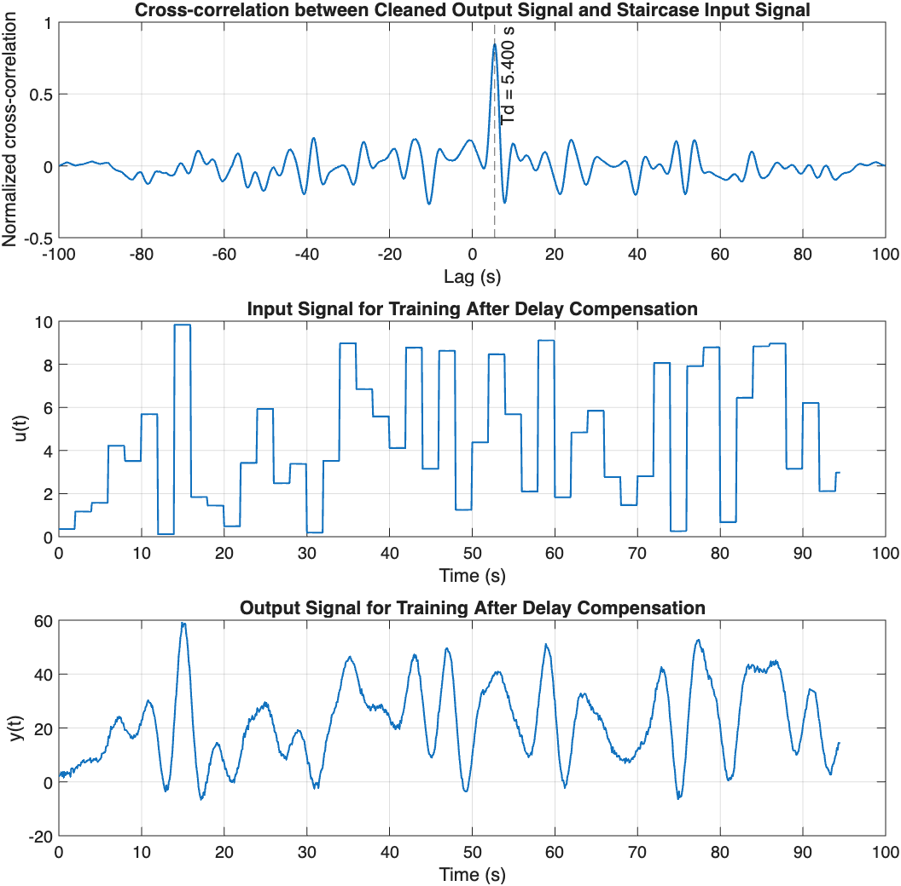

**DC offset.** The DC offset removal for no steady-state bias on identified model.

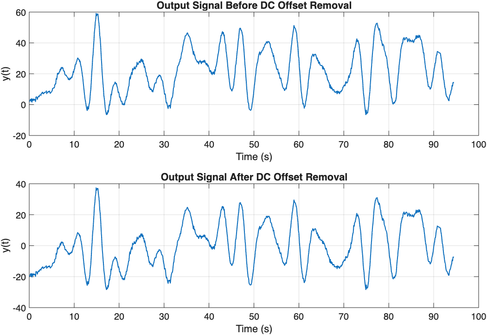

**Validation set.** The validation set is generated with an independently drawn staircase input and processed through the identical preprocessing pipeline.

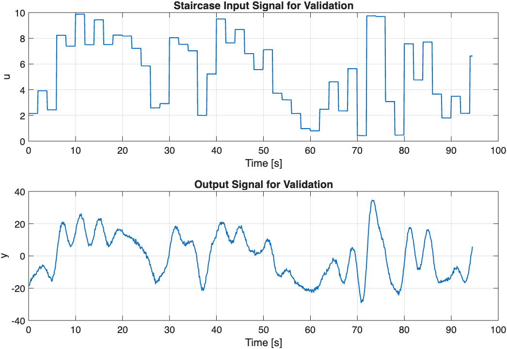

## Part 2: Identification

Identification is carried out in two stages, using PO-MOESP and PEM in combination. PEM's Levenberg Marquardt/Gauss Newton refinement is a local search sensitive to its initial parameter estimate. PO-MOESP's closed form solution approximates the true deterministic dynamics regardless of the noise realization, so it is used first, and its result initializes PEM for refinement.

The identified model is a 3rd-order, SISO discrete-time state-space model in observable canonical form:

$$
x_{k+1} = A x_k + B u_k + K e_k, \qquad y_k = C x_k + e_k
$$

$$
A = \begin{bmatrix} 0 & 1 & 0 \\ 0 & 0 & 1 \\ a_1 & a_2 & a_3 \end{bmatrix}, \quad
B = \begin{bmatrix} b_1 \\ b_2 \\ b_3 \end{bmatrix}, \quad
K = \begin{bmatrix} k_1 \\ k_2 \\ k_3 \end{bmatrix}, \quad
C = \begin{bmatrix} 1 & 0 & 0 \end{bmatrix}
$$

with $e_k$ the one step ahead prediction error. Fixing $A$ and $C$ to this canonical structure means the free parameters are exactly the last row of $A$, all of $B$, all of $K$, and the initial state $x_0$, twelve scalars in total, collected into a parameter vector $\theta$ (`theta2matrices.m`).

**1. PO-MOESP** (`pomoesp.m`) constructs block Hankel matrices of the input and output, separates the input and output row spaces via an economy LQ factorization, and determines the system order from the singular values of the resulting $L_{32}$ block:

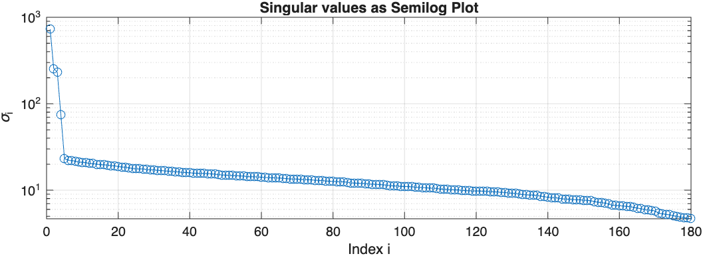

A sharp drop occurs after the third singular value, with a smaller, secondary drop around the fifth. Fitting with $n=5$ produces an unstable simulated model with degraded validation performance: the additional modes do not represent true system dynamics but colored measurement noise strong enough to mimic an extra state, as the residual analysis in Part 3 confirms. $n = 3$ is therefore taken as the true deterministic order; $A$ and $C$ follow from the extended observability matrix, while $x_0$, $B$, and $D$ are obtained from a linear least-squares fit of the output to its predictor regressors.

On the training data, the resulting model captures the low-frequency envelope, but underestimates several peaks and lags behind sharp transitions, the signature of unmodeled colored noise:

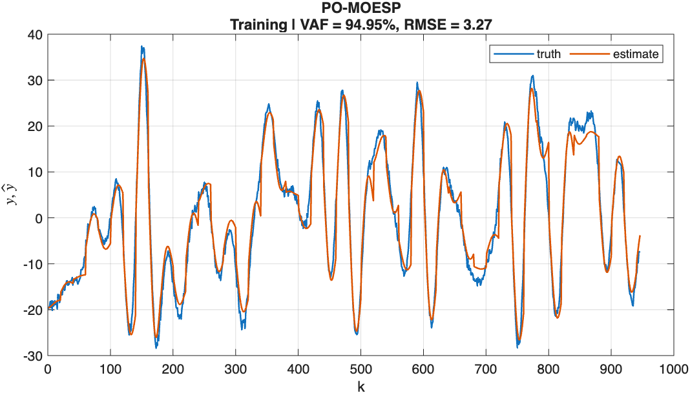

**2. PO-MOESP+PEM.** To capture the colored disturbance that PO-MOESP cannot represent, `pem.m` reparameterizes the same 3rd order structure with an innovations gain $K$ and refines $\theta$ using Levenberg Marquardt/Gauss Newton minimization of the one step ahead prediction error, propagating output and parameter sensitivities through the state recursion at each iteration. It is initialized from the PO-MOESP model, converted to observable canonical form via `obsv(A,C)`, with $K_0 = 0$.

Adding the innovations term tightens the fit almost exactly onto the truth on the training data, including around the sharp transients:

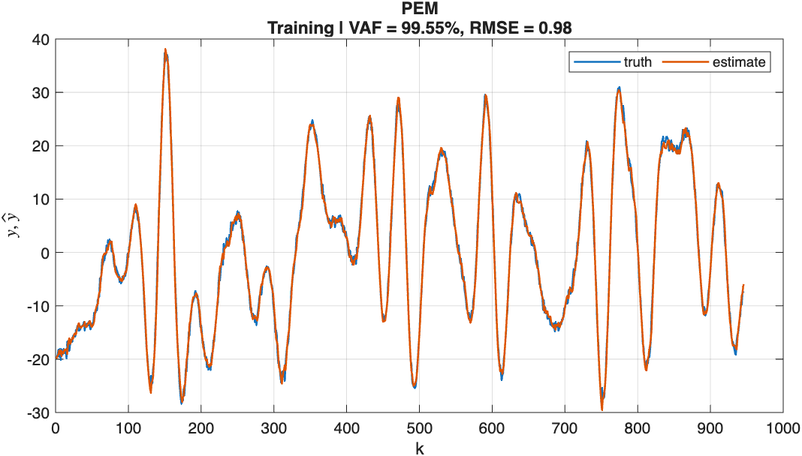

## Part 3: Validation

The identified PEM model  evaluated on the validation data.

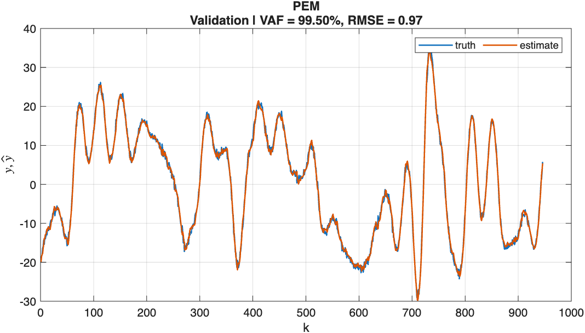

**Residual Analysis.** Residual autocorrelation tests whether the one step ahead prediction error is white, that is, uncorrelated with itself at nonzero lag; structure beyond the 95% confidence bound indicates dynamics the model has not captured. Cross-correlation between the residuals and the input tests whether any input driven dynamics remain unexplained.

In PO-MOESP fit, the residuals are not white: they carry a strong, structured autocorrelation, evidence of colored measurement noise substantial enough to be mistaken for an additional state, the secondary singular value drop noted in Part 2. This is why the deterministic order is fixed at $n=3$ rather than $n=5$, with the disturbance instead modeled separately through PEM's innovations gain $K$.

After PEM, both the autocorrelation of the validation residuals and their cross-correlation with the input remain within the 95% confidence bound for white noise, with no persistent structure at any lag:

| Residual autocorrelation | Residual / input cross-correlation |
|---|---|
| 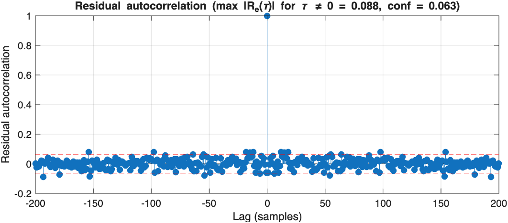 | 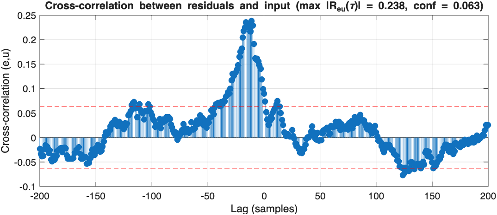 |

This confirms that the ARMAX noise model captures the colored disturbance rather than merely tracking it.

## Repository Layout

```
├── main.m                      entry point - runs the full cycle, split into sections
├── exciteSystem.p              black-box system
├── excitation_input.m          persistently exciting staircase input design
├── pomoesp.m, simulate_pomoesp.m
│                               PO-MOESP subspace identification + open-loop simulation
├── pem.m, simulate_pem.m       PEM/ARMAX identification + one-step-ahead prediction
├── residual_autocorrelation.m, residual_crosscorrelation.m
│                               residual whiteness tests
├── tools/                      supporting utilities, on the path via main.m
│   ├── persistency_of_excitation.m
│   ├── remove_spikes_mad.m, estimate_time_delay.m,
│   │   apply_time_shift.m, remove_dc_offset.m
│   │                           spike removal, delay estimation/compensation, DC offset
│   ├── theta2matrices.m, pem_jacobian.m, pem_hessian.m
│   │                           PEM parameterization and Gauss-Newton building blocks
│   ├── VAF.m, RMSE.m           fit metrics
│   └── plot_results_train.m, plot_results_val.m,
│       animate_pem_validation.m, save_figure.m
│                               fit plots and the hero animation, exported to assets/
└── assets/                     result plots used in this README
```

## Requirements

- MATLAB (developed on R2023b+)
- **System Identification Toolbox**

## Running

```matlab
main
```

This runs the full cycle. When `pomoesp.m` displays the singular-value plot, execution pauses for input in the command window; enter `3`.
